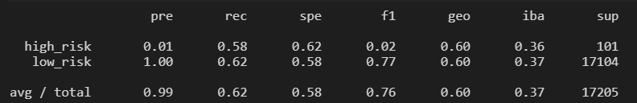
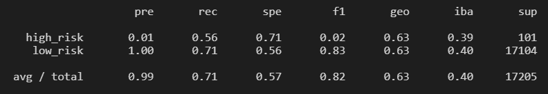
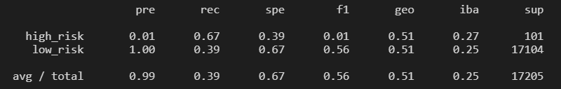
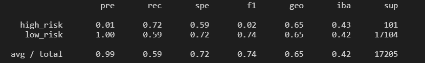
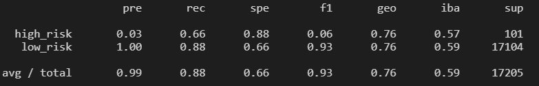
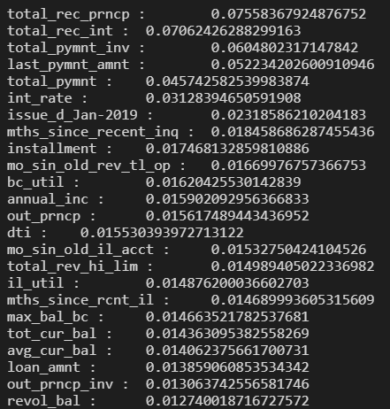
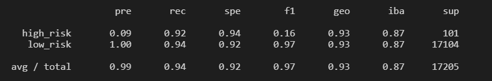

# Credit_Risk_Analysis

## Overview

This project is the weekly challenge for week 17 of the Data Science Bootcamp. It allows us to put into practice and showcase the skills learned in Module 17 of the bootcamp.

### Purpose

The purpose of this analysis is to employ different techniques to train and evaluate models with unbalanced classes.

This would allow us to evaluate the performance fo these models and make recommendations on their suitability to predict credit risk.

## Results

The following files are part of the analysis:

- [credit_risk_resampling.ipynb](credit_risk_resampling.ipynb) : Jupyter Notebook used in deliverables 1 and 2.
- [credit_risk_ensemble.ipynb](credit_risk_ensemble.ipynb) : Jupyter Notebook used in deliverable 3.

### Deliverable 1: Use Resampling Models to Predict Credit Risk

I used the `imbalance-learn` and `scikit-learn` libraries to evaluate the Logistic Regression model under 3 different resampling techniques to determine which one is better at predicting credit risk based on our dataset.

In all cases, the model used was defined as below (note that the `random_state=1` is used to ensure consistency during tests and it wouldn't be used on any production model):

```python
from sklearn.linear_model import LogisticRegression
lr_model = LogisticRegression(solver='lbfgs', random_state=1)
```

#### Naive Random Oversampling

We first used the RandomOverSampler to resample the training data for our model.

```python
ros = RandomOverSampler(random_state=1)
X_resampled, y_resampled = ros.fit_resample(X_train, y_train)
lr_model.fit(X_resampled, y_resampled)
```

The model generates the following evaluations:

Balance Accuracy Score: 0.6038

The confusion matrix is the following:

|  |high_risk predicted	| low_risk predicted|
|:---|:---:|:---:|
|high_risk actual|59|42|
|low_risk actual|6440|10664|

The Imbalanced classification report is the following:



#### SMOTE Oversampling

```python
oversample = SMOTE(sampling_strategy='auto', random_state=1)
X_resampled, y_resampled = oversample.fit_resample(X_train, y_train)
```

Using the SMOTE oversampling technique yield the following evaluations:

Balanced Accuracy Score:  0.6357

The confusion matrix is the following:

|  |high_risk predicted	| low_risk predicted|
|:---|:---:|:---:|
|high_risk actual|57|44|
|low_risk actual|5010|12094|

Imbalanced classification report:



#### Undersampling - Cluster Centroids

We used the ClusteCentroids resamplers are follows:

```python
cc = ClusterCentroids(random_state=1)
X_resampled, y_resampled = cc.fit_resample(X_train, y_train)
```

The model yielded the following evaluations.

Balanced Accuracy Score:  0.5313

The confusion matrix is the following:

|  |high_risk predicted	| low_risk predicted|
|:---|:---:|:---:|
|high_risk actual|68|33|
|low_risk actual|10444|6660|

Imbalanced classification report:



### Deliverable 2: Use the SMOTEENN algorithm to Predict Credit Risk

We used the SMOTEENN algorithm and LogisticRegression model to predict the Credit Risk using the same data as above.

```python
smote_enn = SMOTEENN(random_state=1)
X_resampled, y_resampled = smote_enn.fit_resample(X_train, y_train)
```

The following evaluations were obtained.

Balanced Accuracy Score:  0.6558


The confusion matrix is the following:

|  |high_risk predicted	| low_risk predicted|
|:---|:---:|:---:|
|high_risk actual|73|28|
|low_risk actual|7034|10070|

Imbalanced classification report:



### Deliverable 3: Use Ensemble Classifiers to Predict Credit Risk

We used 2 ensemble classifiers on the same dataset to evaluate their suitability.

#### Balanced Random Forest Classifier

This classifier was used with 100 estimators and `random_state=1` to ensure consistency.

```python
from imblearn.ensemble import BalancedRandomForestClassifier
model = BalancedRandomForestClassifier(n_estimators=100, random_state=1)
model = model.fit(X_train, y_train)
y_pred = model.predict(X_test)
```

The evaluation results are below:

Balanced Accuracy Score:  0.7704

The confusion matrix is the following:

|  |high_risk predicted	| low_risk predicted|
|:---|:---:|:---:|
|high_risk actual|67|34|
|low_risk actual|2097|15007|

Imbalanced classification report:



To look at the importance associated to each feature, we used the following code:

```python
# List the features sorted in descending order by feature importance
features = sorted(zip(model.feature_importances_, X.columns), reverse=True)
for i in features:
    print(i[1],':\t',i[0])
```

These are the top 25 features by importance:



#### Easy Ensemble AdaBoost Classifier

This classifier was used with 100 estimators as well. Notice that the base estimator is the AdaBoost classifier so it was not necessary to include this in the definition.

```python
from imblearn.ensemble import EasyEnsembleClassifier
ee_model = EasyEnsembleClassifier(n_estimators=100, random_state=1)
ee_model.fit(X_train, y_train)
y_pred = ee_model.predict(X_test)
```

The evaluation results are as follows.

Balanced Accuracy Score:  0.9318

The confusion matrix is the following:

|  |high_risk predicted	| low_risk predicted|
|:---|:---:|:---:|
|high_risk actual|93|8|
|low_risk actual|977|16127|

Imbalanced classification report:



### Review of results

Here is a summary of balanced accuracy, precision, recall, index balanced accuracy and F1 computed on the minority class (high_risk).  This information has been compiled from snapshot and result presented above.

|                   |Balanced Accuracy|Precision|Recall|IBA  |   F1|
|---|:---:|:---:|:---:|:---:|:---:|
|Random Oversample|   0.6038|   0.01|   0.58|  0.36|   0.02|
|SMOTE Oversample|    0.6353|   0.01|   0.56|   0.39|   0.02|
|Undersample|         0.5313|   0.01|   0.67|   0.27|   0.01|
|SMOTEENN|            0.6558|   0.01|   0.72|   0.43|   0.02|
|Random Forest|       0.7704|   0.03|   0.66|   0.57|   0.06|
|Easy (AdaBoost) Ensemble|   0.9318|   0.09|   0.92|   0.87|   0.16|

Since the dataset is highly imbalanced, we are concerned with the performance of the model on detecting the minority class(high_risk).

It's important to note, that Accuracy is presented on the table as reference, as it is typically not meaningful on highly imbalanced datasets.

## Summary

As we can see in the summary table above, oversampling, undersampling and combination (SMOTEENN) the dataset for the LogisticRegression model did very little to improve the performance of the model.  Although the recall value peaked at 0.72, the corresponding precision of 0.01 would present a very high number of false positives.

Ensembled methods improved the performance considerably.Cascaded Adaptive Boosting (AdaBoost) increases the recall to 0.92, while also increasing the Precision to 0.09.

Although the precision is still low, having a high recall value for credit risk determination will prove to be a better option.

I would recommend using the Easy Ensemble (AdaBoost) model as it's more important to have a low number of false negatives (unpredicted high_risk accounts) than a relatively high number of false positives (accounts wrongly flagged as high_risk).

As further work, we could analyse the importance of the features and simplify the model by removing those features with very low importance.
